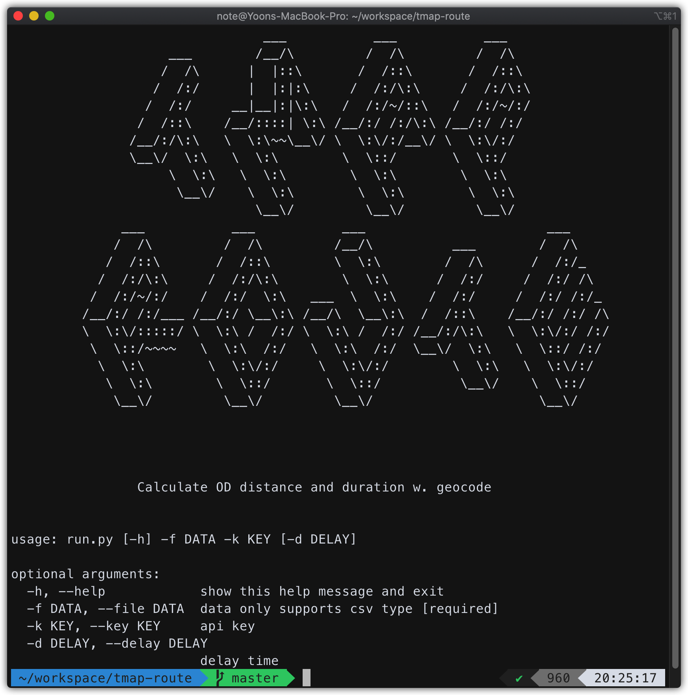
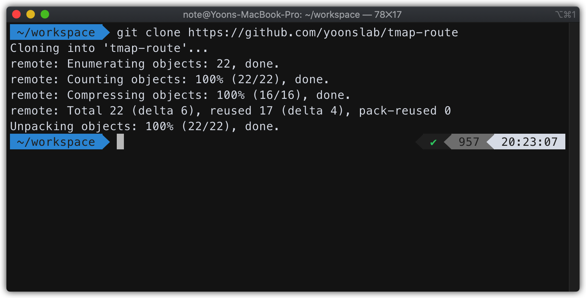
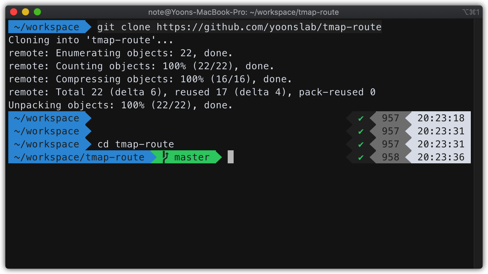
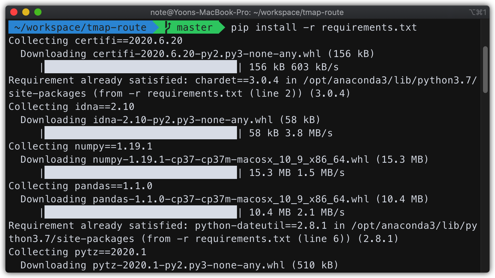
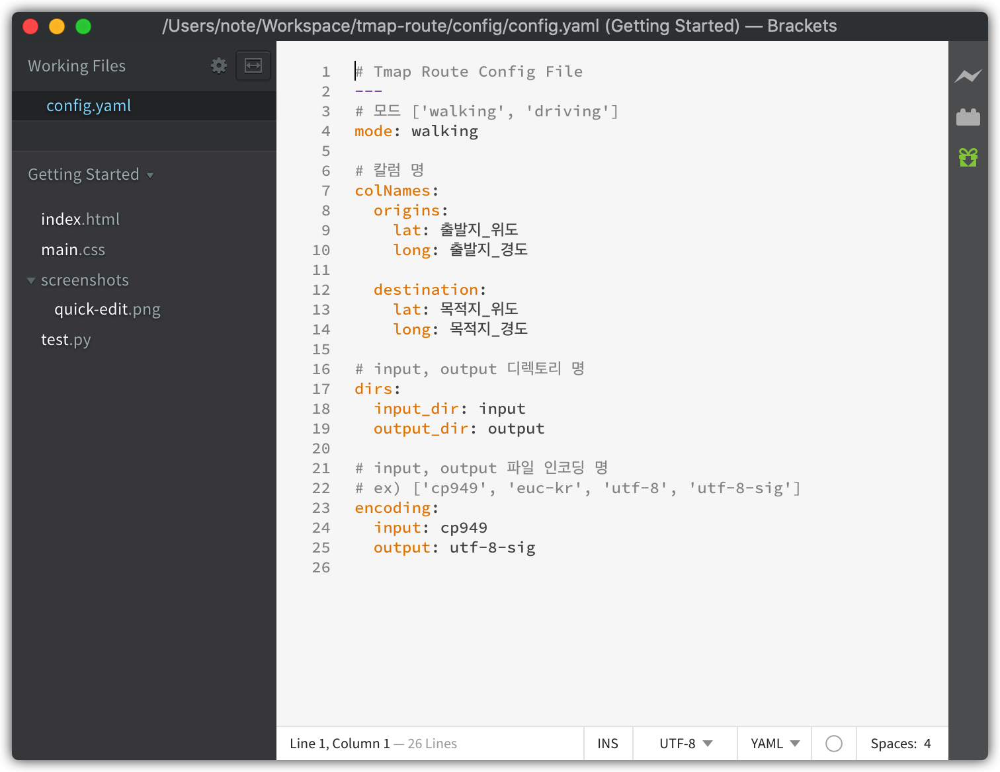

# Tmap Route

Tmap Route는 Tmap API를 활용하여 **출발지와 목적지 경도/위도 정보를 통해 자동차 경로 및 도보 경로의 총 거리/소요시간을 쉽게 편리하게 계산하는 프로그램**입니다.

**Tmap Route를 활용하기 위해선 Tmap API 발급이 필요합니다.** 자세한 사항은 [여기](https://tmapapi.sktelecom.com/main.html#webv2/guide/apiGuide.guide2)를 참고해주세요.

## Requirements

* Python 3 
* T Map API Key
* git

## How To Use

### 환경 설정



1. git에서 파이썬 스크립트 clone
```sh
git colne https://github.com/yoonslab/tmap-route
```




2. tmap-route 경로로 이동
```sh
cd tmap-route
```



3. 필요 패키지 설치
```sh
pip install -r requirements.txt
```


4. **./config/config.yaml** 파일 변경 (옵션 설정)

- `config.yaml` 내용은 다음과 같습니다.

```yaml
# Tmap Route Config File
---
# 모드 ['walking', 'driving']
mode: walking

# 칼럼 명
colNames:
  origins:
    lat: 출발지_위도
    long: 출발지_경도

  destination:
    lat: 목적지_위도
    long: 목적지_경도

# input, output 디렉토리 명
dirs:
  input_dir: input
  output_dir: output

# input, output 파일 인코딩 명
# ex) ['cp949', 'euc-kr', 'utf-8', 'utf-8-sig']
encoding:
  input: cp949
  output: utf-8-sig
```

- mode: 도보경로(walking)/자동차경로(driving)을 수정해주세요.
- colNames: 사용하는 데이터의 칼럼명(첫번째행 이름)과 동일하게 바꿔줍니다.
- dirs: Input 데이터/ Output 데이터 폴더(디렉토리)를 설정해줍니다.  
- encoding: Input 데이터 / OutPut 데이터의 인코딩형식을 변경합니다.<br> 
(인코딩 형식이 다르면 에러가 나오니 인코딩 관련 에러 발생 시 수정이 필요합니다.)

### 파이썬 스크립트 실행
```python
python run.py -f <input폴더의 파일명> -k <API_Key> -d <delay_time>
#e.g. python run.py -f sample.csv -k l7xxff72107ab2cf -d 0.5
```

- <파일명>과 <API_key>는 필수 입력 값입니다.
- <delay_time>은 요청 시간의 딜레이 값입니다. default: 0.5, 요청시간 관련 오류시 값을 조금 더 크게 늘립니다.
- 파이썬 스크립트 관련 옵션은 아래의 명령어로 확인할 수 있습니다.


```python
python run.py --help
```

## Notes
- Tmap API Key(무료) 기준 하루에 1,000건만 요청 할 수 있습니다.
- 컨텐츠 수정 중입니다.